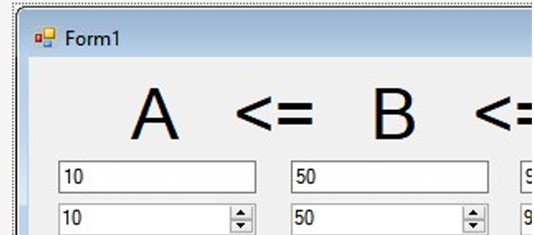

## Лабораторная работа 3. Часть 2 из 2: «MVC» 

Тип приложения: GUI; язык: без ограничений. 

- Создать простейшее приложение с GUI, содержащее: 
    - три целых числа A, B и C со значением в пределах от 0 до 100; - каждое из чисел должно отображаться и редактироваться в 3 разных 
      компонентах: в textBox, numericUpDown, trackBar (или аналогичных в других языках), при этом редактирование числа в одном поле должно приводить к 
      изменению отображения этого числа во всех других полях; 
    - второе число всегда должно быть не меньше первого и не больше третьего; 
    - приложение должно сохранять значения чисел между запусками (запоминать при закрытии и восстанавливать значения при открытии); 

- Разработанное приложение должно быть реализовано в стиле MVC: 
    - хранение трёх чисел должно быть организовано в виде отдельного объекта модели; 
    - все пересчёты, проверки и сохранение должны выполняться в объекте-модели; 
    - изменение A и C должно реализовывать разрешающее поведение (при нарушении ограничений порядка
      модель сама перестраивается, чтобы их выполнить, введённое пользователем значение A и C сохраняется) 
    - изменение B должно реализовывать запрещающее поведение (при нарушении ограничений порядка модель откатывает внесённые пользователем изменения) 
      или ограничивающее поведение (при нарушении ограничений порядка модель корректирует введённое значение так, чтобы оно было как можно ближе к заданному пользователем). 

Пример макета приложения приведён ниже:

При работе над приложением необходимо основное внимание уделить самодостаточности модели, которая должна брать на себя всю ответственность за своё содержимое. Так, 
например, именно модель, а не форма, должна быть ответственной за сохранение и восстановление своих значений (гипотетически с моделью мы должны иметь возможность 
полноценно работать и без создания формы вообще). Модель должна изменяться атомарно: ни в коем случае нельзя допускать ситуации, когда модель сообщает кому-то, что она 
изменилась посередине процесса изменения, когда одно из трёх значений уже изменилось, а остальные ещё нет.

Модель должна по возможности минимизировать испускаемые уведомления:

- любое изменение модели (даже при изменении всех трёх значений) должно приводить только к одному испускаемому уведомлению; 
- если значения в модели не изменились, модель не должна никого уведомлять; 
- при запуске приложения модель должна испускать только одно уведомление (проверьте у себя!), а форма при открытии должна только один раз обновлять своё содержимое. 

- В процессе выполнения работы: 
    - не использовать выделенный контроллер (просто потому, что он, якобы, нужен), или при его использовании аргументировать его необходимость; 
    - модель не должна работать со строками: она работает с числами; 
    - выводить, сколько раз вызывается обновление, обеспечить отсутствие множественных обновлений; 
    - не требовать от модели испускать события (для Qt: эмитить сигнал): только сама модель должна решать, когда ей уведомлять подписчиков; 
    - проверяйте, не утекает ли логика из модели (например, в виде пределов для ползунка от 0 до 100, которые должны задаваться только в модели); 
    - проверяйте, не утекает ли функциональность из модели (кто отвечает за сохранение/восстановление); 
    - проверяйте, можно ли не создавая форму работать с моделью. 

Приложение должно быть разработано так, чтобы никакие действия пользователя не 
приводили к тому, что отображаемые значения (кроме как в процессе редактирования) 
нарушали бизнес-правила. Необходимо обрабатывать такие действия пользования, как уход 
фокуса из любого элемента управления, ввод нечислового текста или стирание значения в элементе управления. 

При защите лабораторной работы необходимо продемонстрировать, что никакие действия 
пользователя не приводят к нарушению требуемых бизнес-правил. 

Материалы: https://www.youtube.com/watch?v=q0OsToAZzPI 
